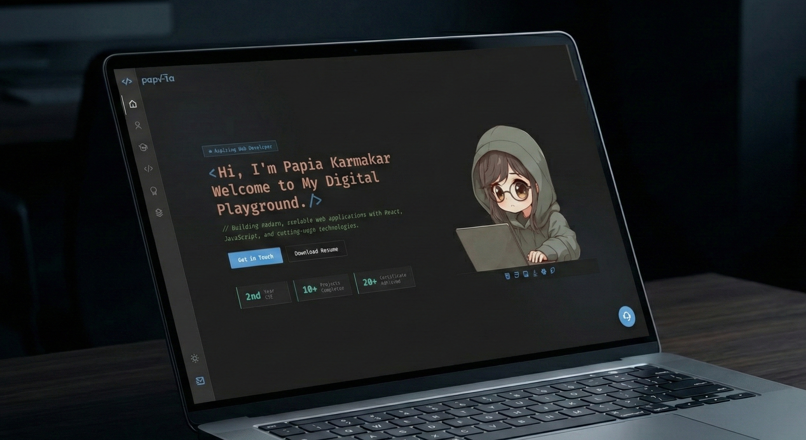

# 💻 Personal Portfolio Website

<p align="center">
  
</p>

A modern, VS Code-inspired portfolio website showcasing my projects, technical skills, certifications, academic journey, and achievements as a Computer Science student.

## ✨ Highlights

* Responsive design for desktop and mobile
* Interactive developer-themed UI
* Skills, education, and certifications showcase
* Featured projects section
* Resume download support
* Contact and social links

## 📂 Folder Structure

Based on your project workspace layout, here is the directory tree:

```text
Portfolio/
├── images/
│   ├── Favicon.png
│   ├── Portfolio.png
│   ├── Project1.png
│   ├── Project2.png
│   ├── Project3.png
│   ├── Project4.png
│   └── logo.png
├── js/
│   └── security.js
├── README.md
├── index.html
└── thankyou.html
```

## 🛠️ Tech Stack

HTML • CSS • JavaScript • Remix Icons • Devicon

## 🚀 Run Locally

Clone the project repository to your machine:

```bash
git clone https://github.com/Papia-tech/Portfolio.git
cd Portfolio
```

## ✍ Author

Created by Papia Karmakar

## 🔒 License
Copyright © 2026 Papia Karmakar. All rights reserved.
